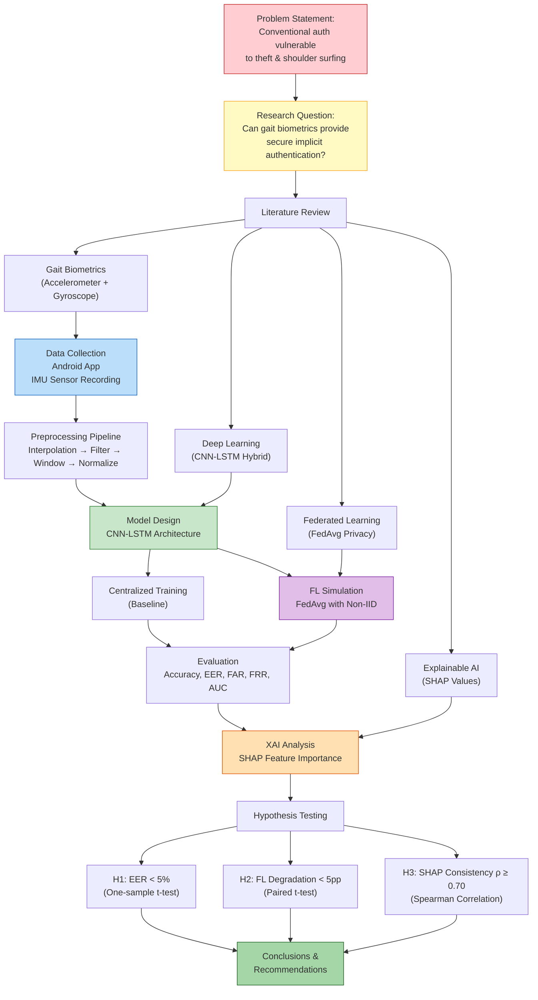
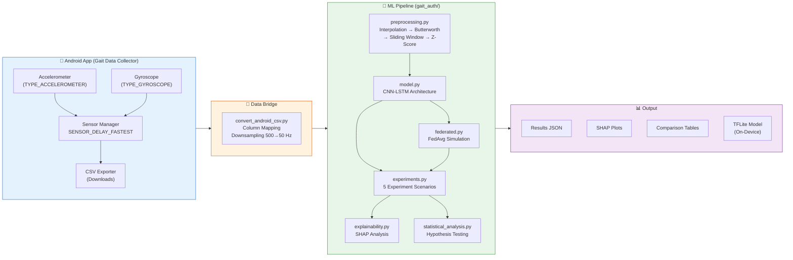
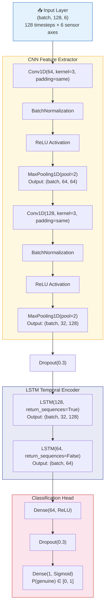
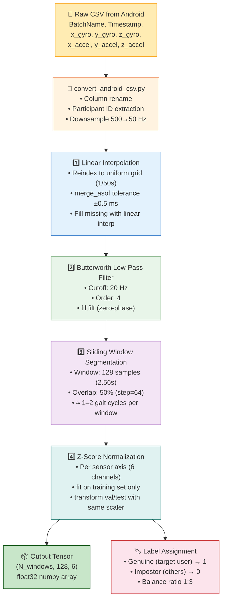
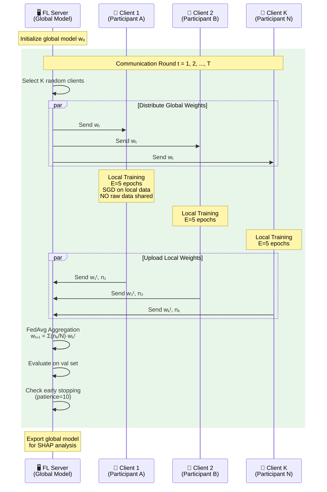
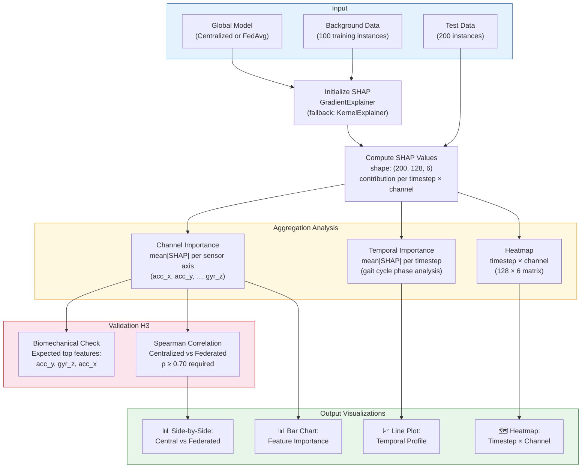
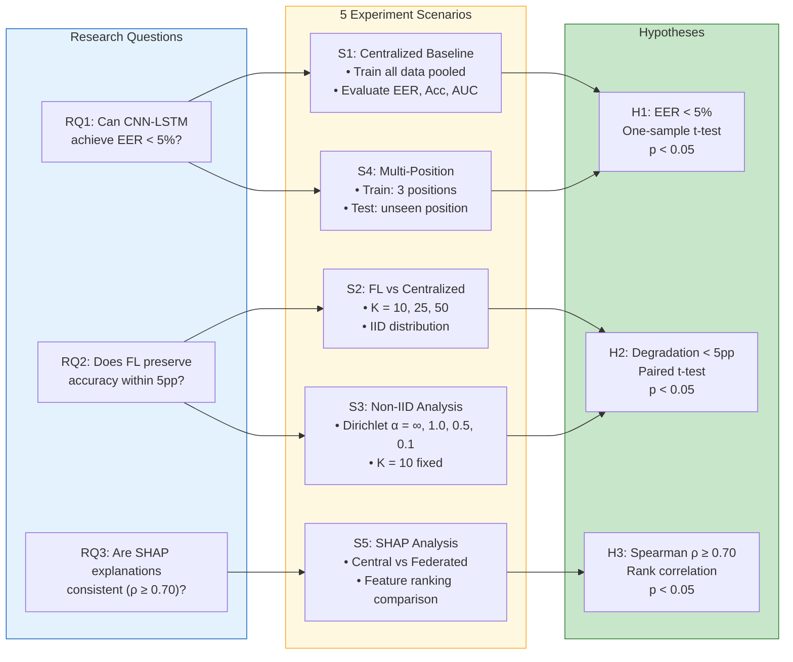
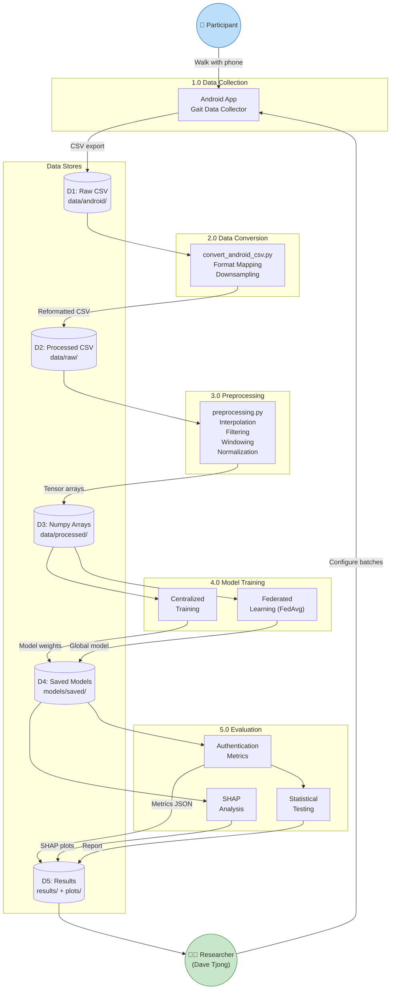
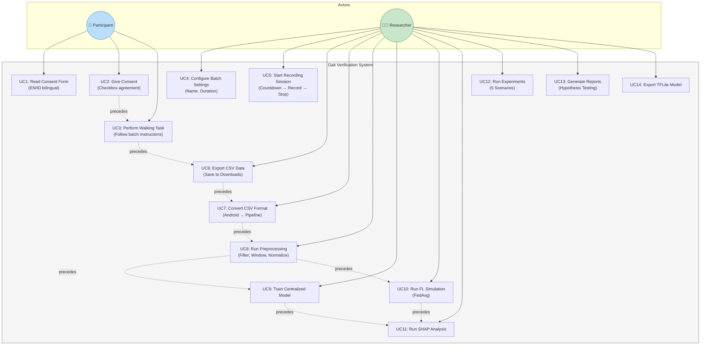
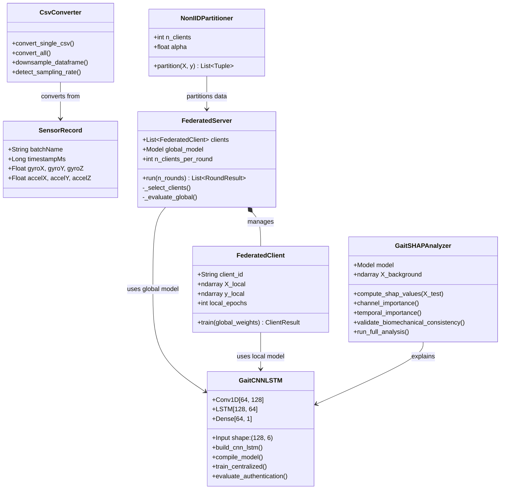

# Thesis Diagrams — Explicit Gait Verification for Secure Authentication Using Explainable Federated Learning

All diagrams below are in Mermaid format, ready to render or export as images for your thesis.

---

## 1. Kerangka Berpikir (Conceptual Framework Flowchart)

This is the end-to-end research flow from problem identification to conclusions.

---

## 2. System Architecture Diagram

Full system overview from mobile data collection to model deployment.

---

## 3. CNN-LSTM Model Architecture

Detailed layer-by-layer neural network structure.

---

## 4. Data Preprocessing Pipeline

Signal processing from raw CSV to model-ready tensor.

---

## 5. Federated Learning — FedAvg Protocol

Communication rounds between server and clients.

---

## 6. SHAP Explainability Pipeline

How Explainable AI is applied to the trained model.

---

## 7. Experiment Design — 5 Scenarios Mapped to Hypotheses

---

## 8. Data Flow Diagram (DFD) — Level 1

Complete data lifecycle from collection to results.

---

## 9. Use Case Diagram

Actor interactions with the system.

---

## 10. Class Diagram — Core Python Modules

---

## Quick Reference: File → Diagram Mapping

| Diagram | Source Module | Purpose |
|---------|-------------|---------|
| 1. Kerangka Berpikir | (conceptual) | Research methodology overview |
| 2. System Architecture | All modules | Technical system overview |
| 3. CNN-LSTM | `model.py` | Neural network layer details |
| 4. Preprocessing | `preprocessing.py` | Signal processing pipeline |
| 5. FedAvg Protocol | `federated.py` | FL communication rounds |
| 6. SHAP Pipeline | `explainability.py` | XAI analysis workflow |
| 7. Experiment Design | `experiments.py` | 5 scenarios → hypotheses |
| 8. DFD | All modules | Data lifecycle |
| 9. Use Case | Android + Pipeline | Actor interactions |
| 10. Class Diagram | All `.py` modules | OOP structure |
