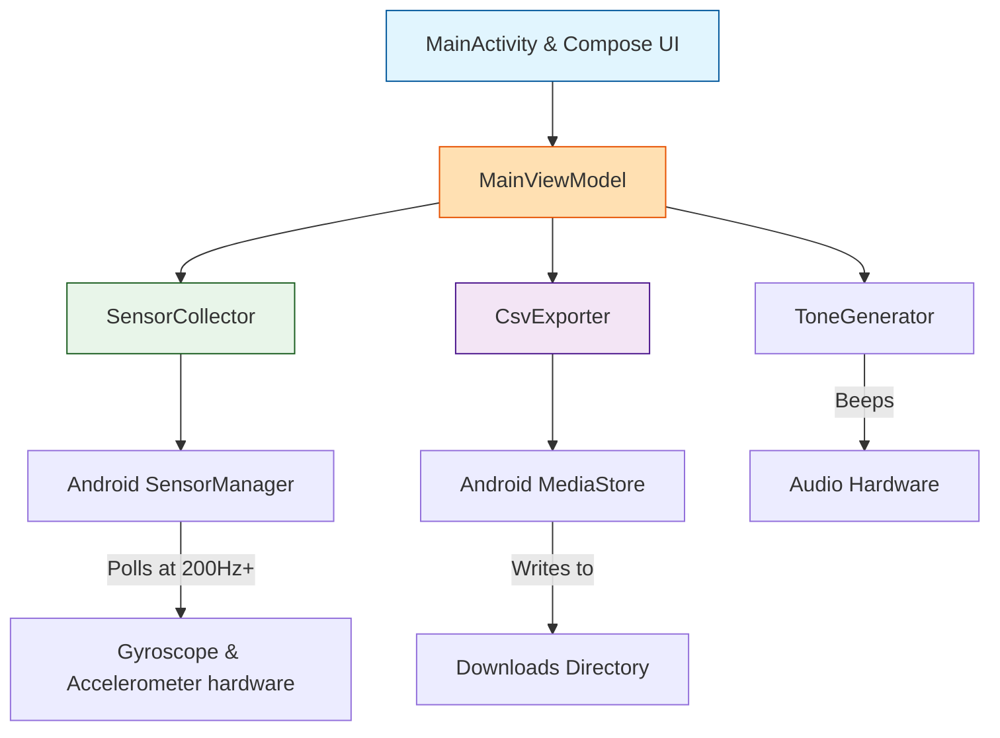
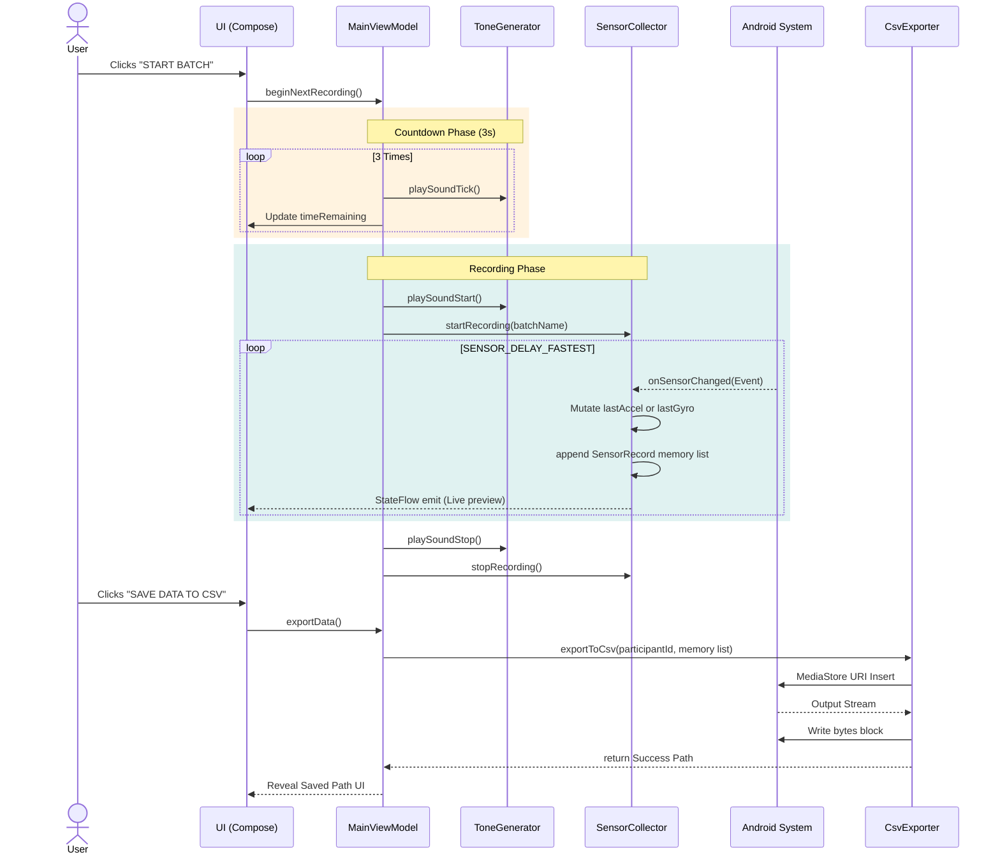
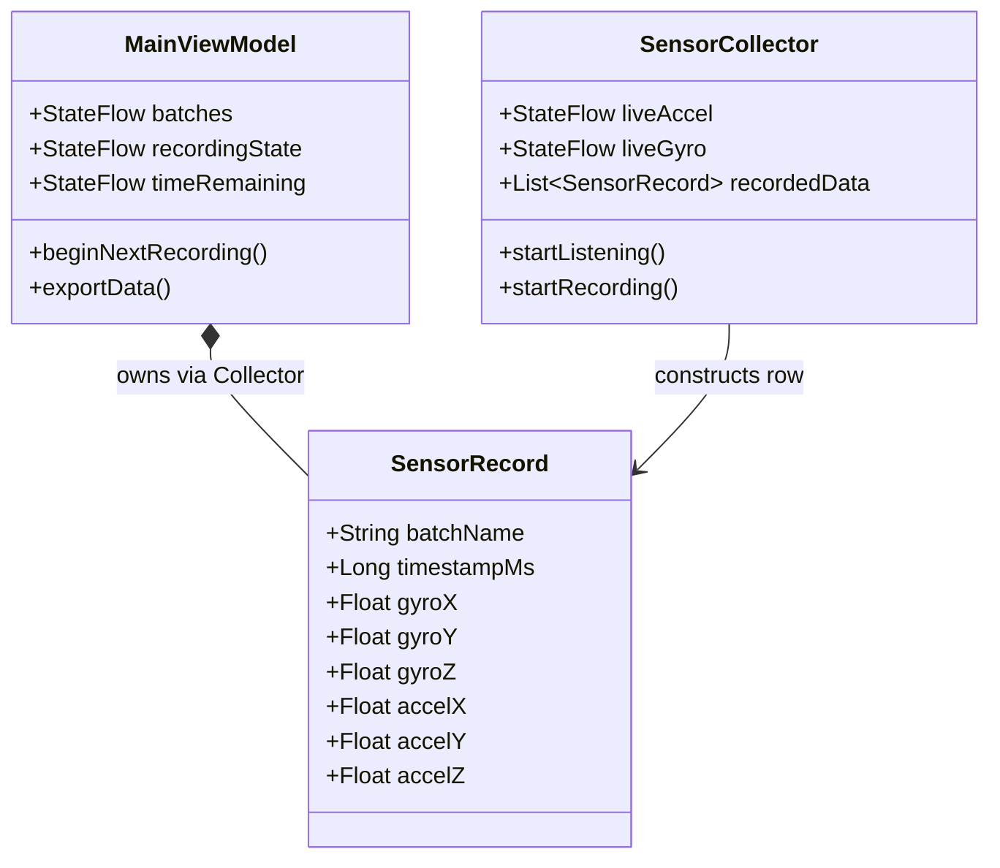

# Gait Data Collector Tech Architecture

Below are the architectural and sequence diagrams for the Gait Data Collector application built using Kotlin, Jetpack Compose, and the Android Sensor API.

## High-Level Component Diagram

## Data Flow & Recording Sequence

## Data Structure

